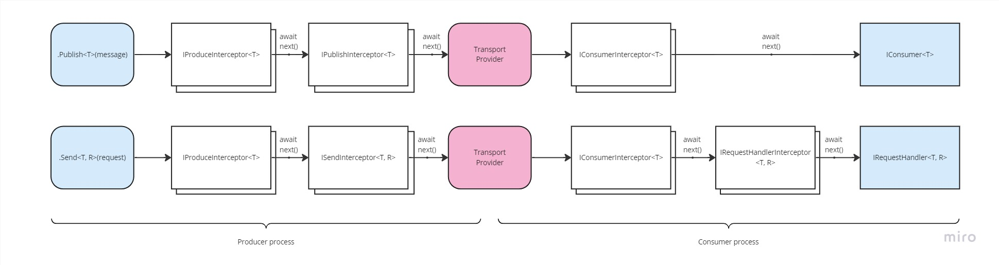

# Introduction to SlimMessageBus <!-- omit in toc -->

- [Configuration](#configuration)
- [Pub/Sub communication](#pubsub-communication)
  - [Producer](#producer)
    - [Set message headers](#set-message-headers)
  - [Consumer](#consumer)
    - [Start or Stop message consumption](#start-or-stop-message-consumption)
        - [Health check circuit breaker](#health-check-circuit-breaker)
    - [Consumer context (additional message information)](#consumer-context-additional-message-information)
    - [Per-message DI container scope](#per-message-di-container-scope)
    - [Hybrid bus and message scope reuse](#hybrid-bus-and-message-scope-reuse)
    - [Concurrently processed messages](#concurrently-processed-messages)
- [Request-response communication](#request-response-communication)
  - [Delivery guarantees](#delivery-guarantees)
  - [Dedicated reply queue/topic](#dedicated-reply-queuetopic)
  - [Message headers for request-response](#message-headers-for-request-response)
  - [Produce request message](#produce-request-message)
  - [Consume the request message (the request handler)](#consume-the-request-message-the-request-handler)
  - [Request without response](#request-without-response)
- [Static accessor](#static-accessor)
- [Dependency Resolver](#dependency-resolver)
  - [Dependency auto-registration](#dependency-auto-registration)
  - [ASP.Net Core](#aspnet-core)
  - [Modularization of configuration](#modularization-of-configuration)
  - [Auto registration of consumers and interceptors](#auto-registration-of-consumers-and-interceptors)
  - [Message Scope Accessor](#message-scope-accessor)
- [Serialization](#serialization)
- [Multiple message types on one topic (or queue)](#multiple-message-types-on-one-topic-or-queue)
  - [Message Type Resolver](#message-type-resolver)
  - [Polymorphic messages](#polymorphic-messages)
    - [Polymorphic producer](#polymorphic-producer)
    - [Polymorphic consumer](#polymorphic-consumer)
- [Message Headers](#message-headers)
- [Interceptors](#interceptors)
  - [Producer Lifecycle](#producer-lifecycle)
  - [Consumer Lifecycle](#consumer-lifecycle)
  - [Order of Execution](#order-of-execution)
  - [Generic interceptors](#generic-interceptors)
- [Error Handling](#error-handling)
- [Logging](#logging)
- [Debugging](#debugging)
- [Provider specific functionality](#provider-specific-functionality)

## Configuration

SlimMessageBus integrates with [`Microsoft.Extensions.DependencyInjection` (MSDI)](https://www.nuget.org/packages/Microsoft.Extensions.DependencyInjection.Abstractions) and thus can be configured in a streamlined way using [`.AddSlimMessageBus()`](../src/SlimMessageBus.Host/DependencyResolver/ServiceCollectionExtensions.cs) extension method:

```cs
// IServiceCollection services;

services.AddSlimMessageBus(mbb =>
{
  // Bus configuration happens here (...)
});
```

The `mbb` parameter (of type [`MessageBusBuilder`](../src/SlimMessageBus.Host.Configuration/Builders/MessageBusBuilder.cs)) is used to configure the message bus. Several elements can be configured:

- The bus transport provider (Apache Kafka, Azure Service Bus, Memory, Hybrid).
- The serialization plugin.
- Declaration of messages produced and consumed along with topic/queue names.
- Request-response configuration (if enabled).
- Additional provider-specific settings (message partition key, message id, etc).
- Registration and configuration of additional plugins.

Sample bus configuration is shown below:

```cs
services.AddSlimMessageBus(mbb =>
{
  // Use the Kafka transport provider
  mbb.WithProviderKafka(cfg => cfg.BrokerList = "localhost:9092");

  // Use Azure Service Bus transport provider (requires SlimMessageBus.Host.AzureServiceBus package)
  //.WithProviderServiceBus(...)
  // Use Azure Event Hub transport provider (requires SlimMessageBus.Host.AzureEventHub package)
  //.WithProviderEventHub(...)
  // Use Redis transport provider (requires SlimMessageBus.Host.Redis package)
  //.WithProviderRedis(...)
  // Use in-memory transport provider (requires SlimMessageBus.Host.Memory package)
  //.WithProviderMemory(...)

  // Pub/Sub example:
  mbb.Produce<AddCommand>(x => x.DefaultTopic("add-command")); // By default AddCommand messages will go to 'add-command' topic (or hub name when Azure Service Hub provider)
  mbb.Consume<AddCommand>(x => x
    .Topic("add-command")
    .WithConsumer<AddCommandConsumer>()
    //.KafkaGroup(consumerGroup) // Kafka provider specific (Kafka consumer group name)
  );

  // Req/Resp example:
  mbb.Produce<MultiplyRequest>(x => x.DefaultTopic("multiply-request")); // By default AddCommand messages will go to 'multiply-request' topic (or hub name when Azure Service Hub provider)
  mbb.Handle<MultiplyRequest, MultiplyResponse>(x => x
    .Topic("multiply-request") // Topic to expect the request messages
    .WithHandler<MultiplyRequestHandler>()
    //.KafkaGroup(consumerGroup) // Kafka provider specific (Kafka consumer group name)
  );
  // Configure response message queue (on topic) when using req/resp
  mbb.ExpectRequestResponses(x =>
  {
    x.ReplyToTopic(topicForResponses); // All responses from req/resp will return on this topic (the EventHub name)
    x.DefaultTimeout(TimeSpan.FromSeconds(20)); // Timeout request sender if response won't arrive within 10 seconds.
    //x.KafkaGroup(responseGroup); // Kafka provider specific (Kafka consumer group)
  });

  // Find consumers and handlers in the current assembly and register in the DI
  mbb.AddServicesFromAssembly(Assembly.GetExecutingAssembly());

  // Use JSON for message serialization
  mbb.AddJsonSerializer(); // requires SlimMessageBus.Host.Serialization.Json package
});
```

The builder (`mbb`) is the blueprint for creating message bus instances `IMessageBus`.

See [Dependency auto-registration](#dependency-auto-registration) for how to scan the consumer types and register them automatically within the DI.

The `.AddSlimMessageBus()`:

- Registers the `IMessageBus`, `IPublishBus`, `IRequestResponseBus` and other core services.
- Registers a [`IHostedService`](https://learn.microsoft.com/en-us/dotnet/api/microsoft.extensions.hosting.ihostedservice) implementation for the [.NET Generic Host](https://learn.microsoft.com/en-us/dotnet/core/extensions/generic-host) which starts the bus consumers on application host start.
- Can be used multiple times, the configuration will be additive as it provides the same `mbb` instance.

Having done the SMB setup, one can then inject [`IMessageBus`](../src/SlimMessageBus/IMessageBus.cs) to publish or send messages.

> The `IMessageBus` implementations are lightweight and thread-safe.

For completeness, please also see the [Hybrid provider configuration](provider_hybrid.md#configuration) which might be needed if the application needs to use more than one transport.

## Pub/Sub communication

### Producer

Use `.Produce<TMessage>()` method on the builder to declare that the bus will produce a message:

```cs
mbb.Produce<SomeMessage>(x =>
{
  // this is optional
  x.DefaultTopic("some-topic");
  //x.WithModifier(...) other provider specific extensions
});
```

Having the declaration, the application can publish a message:

```cs
var msg = new SomeMessage("ping");

// delivered to "some-topic" by default
await bus.Publish(msg);

// OR delivered to the specified topic (or queue)
await bus.Publish(msg, "other-topic");

// pass cancellation token
await bus.Publish(msg, cancellationToken: ct);
```

> The transport plugins might introduce additional configuration options. Please check the relevant provider docs. For example, Azure Service Bus, Azure Event Hub and Kafka allow setting the partitioning key for a given message type.

#### Set message headers

> Since version 1.15.0

Whenever the message is published (or sent in request-response), headers can be set to pass additional information with the message:

```cs
await bus.Publish(new CustomerEvent { }, headers: new Dictionary<string, object> { ["CustomerId"] = 1234 });
```

It is also possible to specify a producer-wide modifier for message headers. This can be used if you need to add some specific headers for every message.

```cs
mbb
   .Produce<SomeMessage>(x =>
   {
      x.DefaultTopic(someMessageTopic);
      x.WithHeaderModifier((headers, message) =>
      {
          headers["CustomerId"] = message.CustomerId;
      });
   })
```

Finally, it is possible to specify a headers modifier for the entire bus (it will apply to all outgoing messages):

```cs
mbb
   .WithHeaderModifier((headers, message) =>
   {
      headers["Source"] = "Customer-MicroService";
   })
```

### Consumer

To consume a message type from a topic/queue, declare it using `Consume<TMessage>()` method:

```cs
mbb.Consume<SomeMessage>(x => x
  .Topic("some-topic") // or queue name
  .WithConsumer<SomeConsumer>() // (1)
  // if you do not want to implement the IConsumer<T> interface
  // .WithConsumer<AddCommandConsumer>(nameof(AddCommandConsumer.MyHandleMethod)) // (2) uses reflection
  // .WithConsumer<AddCommandConsumer>((consumer, message, consumerContext, cancellationToken) => consumer.MyHandleMethod(message)) // (3) uses a delegate
  .Instances(1)
  //.KafkaGroup("some-consumer-group")) // Kafka provider specific extensions
```

When the consumer implements the `IConsumer<SomeMessage>` interface:

```cs
public class SomeConsumer : IConsumer<SomeMessage>
{
  public async Task OnHandle(SomeMessage msg, CancellationToken cancellationToken)
  {
    // handle the msg
  }
}
```

The `SomeConsumer` needs to be registered in the DI container. The SMB runtime will ask the DI to provide the consumer instance.

> When `.WithConsumer<TConsumer>()` is not declared, then a default consumer of type `IConsumer<TMessage>` will be assumed (since v2.0.0).

Alternatively, if you do not want to implement the `IConsumer<SomeMessage>`, then you can provide the method name _(2)_ or a delegate that calls the consumer method _(3)_.
`IConsumerContext` and/or `CancellationToken` can optionally be included as parameters to be populated on invocation when taking this approach:

```cs
public class SomeConsumer
{
  public async Task MyHandleMethod(SomeMessage msg, IConsumerContext consumerContext, CancellationToken cancellationToken)
  {
    // handle the msg
  }
}
```

#### Start or Stop message consumption

By default message consumers are started as soon as the bus is created. This means that messages arriving on the given transport will be processed by the declared consumers.
If you want to prevent this default use the following setting:

```cs
mbb.AutoStartConsumersEnabled(false); // default is true
```

Later inject `IConsumerControl` which exposes a `Start()` and `Stop()` methods to respectively start message consumers or stop them.

```cs
IConsumerControl consumerControl = (IConsumerControl)bus; // Need to reference SlimMessageBus.Host package

// Start message consumers
await consumerControl.Start();

// or

// Stop message consumers
await consumerControl.Stop();
```

> Since version 1.15.5

#### Health check circuit breaker

Consumers can be linked to [.NET app health checks](https://learn.microsoft.com/en-us/dotnet/core/diagnostics/diagnostic-health-checks) [tags](https://learn.microsoft.com/en-us/aspnet/core/host-and-deploy/health-checks#register-health-check-services), enabling or disabling the consumer based on the health check status reported by the [Health Check Publisher](https://learn.microsoft.com/en-us/aspnet/core/host-and-deploy/health-checks#health-check-publisher). A consumer associated with one or more tags will only be active if all health checks linked to the tags are passing.

```cs
    // add health checks with tags
    builder.Services
        .AddHealthChecks()
        .AddCheck<StorageHealthCheck>("Storage", tags: ["Storage"]);
        .AddCheck<SqlServerHealthCheck>("SqlServer", tags: ["Sql"]);

    builder.Services
        .AddSlimMessageBus(mbb => {
            ...

            mbb.Consume<Message>(cfg => {
                ...

                // configure consumer to monitor tag/state
                cfg.PauseOnUnhealthyCheck("Storage");
                cfg.PauseOnDegradedHealthCheck("Sql");
            })
        })
```
*Requires: SlimMessageBus.Host.CircuitBreaker.HealthCheck*

#### Consumer context (additional message information)

The consumer can access the [`IConsumerContext`](../src/SlimMessageBus/IConsumerContext.cs) object which:

- allows to access additional message information - topic (or queue) name the message arrived on, headers, cancellation token,
- enable the transport provider to pass additional message information specific to the chosen transport.

Examples of such transport specific information are the Azure Service Bus UserProperties, or Kafka Topic-Partition offset.

The recommended (and newer) approach is to define a consumer type that implements `IConsumer<IConsumerContext<TMessage>>`.
For example:

```cs
// The consumer wraps the message type in IConsumerContext<T>
public class PingConsumer : IConsumer<IConsumerContext<PingMessage>>
{
   public Task OnHandle(IConsumerContext<PingMessage> context, CancellationToken cancellationToken)
   {
      var message = context.Message; // the message (here PingMessage)
      var topic = context.Path; // the topic or queue name
      var headers = context.Headers; // message headers
      // Kafka transport specific extension (requires SlimMessageBus.Host.Kafka package):
      var transportMessage = context.GetTransportMessage();
      var partition = transportMessage.TopicPartition.Partition;
   }
}

// To declare the consumer type use the .WithConsumerOfContext<TConsumer>() method
mbb.Consume<SomeMessage>(x => x
    .Topic("some-topic")
    .WithConsumerOfContext<PingConsumer>()
  );
```

The other approach is for the consumer to implement the [`IConsumerWithContext`](../src/SlimMessageBus/IConsumerWithContext.cs) interface:

```cs
public class PingConsumer : IConsumer<PingMessage>, IConsumerWithContext
{
   public IConsumerContext Context { get; set; }

   public Task OnHandle(PingMessage message, CancellationToken cancellationToken)
   {
      var topic = Context.Path; // the topic or queue name
      var headers = Context.Headers; // message headers
      // Kafka transport specific extension (requires SlimMessageBus.Host.Kafka package):
      var transportMessage = Context.GetTransportMessage();
      var partition = transportMessage.TopicPartition.Partition;
   }
}
```

SMB will set the `Context` property before executing `OnHandle`.

Please consult the individual transport provider documentation to see what is available.

> It is important that the consumer type is registered as either transient (prototype) or scoped (per message) for the `Context` property to work properly.
> If the consumer type would be a singleton, then somewhere between the setting of `Headers` and running the `OnHandle` there would be a race condition.

#### Per-message DI container scope

SMB can be configured to create a DI scope for every message being consumed. That is if the chosen DI container supports child scopes.
This allows to have a scoped `IConsumer<T>` or `IRequestHandler<TRequest, TResponse>` which can have any dependant collaborators that are also scoped (e.g. EF Core DataContext).

```cs
IMessageBusBuilder mbb;

mbb.PerMessageScopeEnabled(true); // this will set the default setting for each consumer to create per-message scope in the DI container for every message about to be processed

// SomeConsumer will be resolved from a child scope created for each consumed message - the default bus setting will apply
mbb.Consume<Message>(x => x
  .Topic("topic")
  .WithConsumer<TConsumer>()
);

// AnotherConsumer will be resolved from the root DI for each message
mbb.Consume<Message2>(x => x
  .Topic("topic2")
  .WithConsumer<TConsumer2>()
  .PerMessageScopeEnabled(false) // override the bus global default setting and do not create scope for each message on this consumer
);
```

> Per-message scope is enabled by default for all transports except the in-memory transport. This should work for most scenarios.

For more advanced scenarios (third-party plugins) the SMB runtime provides a static accessor `MessageScope.Current` which allows getting ahold of the message scope for the currently running consumer instance.

#### Hybrid bus and message scope reuse

In the case of using the hybrid message bus (`mbb.WithProviderHybrid()`) you might have a setup where there are two or more bus instances.
For example, the Azure Service Bus (ASB) might be used to consume messages arriving to the service (by default each arriving message will have a DI scope created) and the memory bus (`SlimMessageBus.Host.Memory`) to implement domain events.
In this scenario, the arriving message on ASB would create a message scope, and as part of message handling your code might raise some domain events (in process messages) via the Memory bus.
Here the memory bus would detect there is a message scope already started and will use that to resolve its domain handlers/consumers and required dependencies.

> In a Hybrid bus setup, the Memory bus will detect if there is already a started message scope and use that to resolve its dependencies from.

#### Concurrently processed messages

The `.Instances(n)` allows setting the number of concurrently processed messages within the same consumer type.

```cs
mbb.Consume<SomeMessage>(x => x
  .Topic("topic")
  .WithConsumer<TConsumer>()
  .Instances(3) // At most there will be 3 instances of messages processed simultaneously
);
```

> The default is `1`.

Some transports underlying clients do support concurrency natively (like Azure Service Bus), others do not support concurrent message handling (like Redis) in which case SMB will parallelize processing.

SMB manages a critical section for each consumer type registration that ensures there are at most `n` processed messages.
Each processing of a message resolves the `TConsumer` instance from the DI.

> Please note that anything higher than 1 will cause multiple messages to be consumed concurrently in one service instance. This will typically impact message processing order (ie 2nd message might get processed sooner than the 1st message).

## Request-response communication

SMB provides an implementation of request-response over topics or queues - depending on what the underlying provider supports.
This allows one to asynchronously await a response for a request message that your service sent.

Typically this simplifies service interactions that need to wait for a result. To make your app scalable, there is no need to rewrite the interaction as fire and forget style, with storing the state and writing another consumer that resumes processing when the response arrives.

### Delivery guarantees

Since the response is asynchronously awaited, upon arrival the processing context is available (references to objects, other tasks etc) and the service can resume right away. On top of that, since the interaction is asynchronous this allows to achieve a reactive architecture that can scale out - the request handling service will process when available, and the requesting service releases any threads.

The only overhead is memory and resources kept while the sender is awaiting for the response. There is an easy way to set timeouts for request messages in case the response would not arrive in an expected window. Timeout is configured globally, or per each request message type.

> Please note that if the sending service instance dies while awaiting a response, then after restart the service instance won't resume from that await point as all the context and TPL task will be long gone. If you cannot afford for this to happen consider using [Saga pattern](https://microservices.io/patterns/data/saga.html) instead of request-response.

### Dedicated reply queue/topic

The implementation requires that each micro-service instance that intends to sends request messages needs to have its _own and dedicated_ queue (or topic) onto which other request handling micro-services send the response once they process the request.

> It is important that each request sending service instance has its own dedicated topic (or queue) for receiving replies. Please also consult the transport provider documentation too.

### Message headers for request-response

In the case of request (or response) message, the SMB implementation needs to pass additional metadata information to make the request-response work (correlate response with a pending request, pass error message back to sender, etc).
For majority of the transport providers SMB leverages the native message headers of the underlying transport (when the transport supports it). In the transports that do not natively support headers (e.g. Redis) each request (or response) message is wrapped by SMB into a special envelope which makes the implementation transport provider agnostic (see type `MessageWithHeaders`).

When header emulation is taking place, SMB uses a wrapper envelope that is binary and should be fast. See the [`MessageWithHeadersSerializer`](https://github.com/zarusz/SlimMessageBus/blob/master/src/SlimMessageBus.Host/RequestResponse/MessageWithHeadersSerializer.cs) for low level details (or if you want to serialize the wrapper in a different way).

The request contains headers:

- `RequestId` (string) so that the request sender can correlate the arriving responses.
- `Expires` (long) which is a datetime (8 bytes long type, UTC, expressed in unix epoch) of when the request message (expires on).
- `ReplyTo` (string) topic/queue name, so that the service handling the request knows where to send back the response.
- The body of the request message (serialized using the chosen serialization provider).

The response contains headers:

- `RequestId` (string) so that the request sender can correlate the arriving responses.
- `Error` (string) message, in case the request message processing failed (so that we can fail fast and know the particular error).

### Produce request message

The request messages can use the optional marker interface [`IRequest<TResponse>`](../src/SlimMessageBus/RequestResponse/IRequest.cs):

```cs
// Option 1:
public class SomeRequest : IRequest<SomeResponse> // Implementing the marker interface is optional
{
}

// Option 2:
// public class SomeRequest // The marker interface is not used (it's not mandatory)
// {
// }

public class SomeResponse
{
}
```

The micro-service that will be sending the request messages needs to enable request-response and configure its topic for response messages to arrive on:

```cs
// Configure response message queue (or topic) when using req/resp for the request sending side
.ExpectRequestResponses(x =>
{
  x.ReplyToTopic("servicename-instance1"); // All responses from req/resp will return on this topic
  x.DefaultTimeout(TimeSpan.FromSeconds(20)); // Timeout request sender if response won't arrive within 10 seconds.
  //x.KafkaGroup("some-consumer-group"); // Kafka provider specific setting
})
```

The request sending side declares the request message using `.Produce<TMessage>()` method:

```cs
mbb.Produce<SomeRequest>(x =>
{
  // this is optional
  x.DefaultTopic("do-some-computation-topic");
})
```

Once the producer side is configured you can send the request message to a topic (or queue) like so:

```cs
var req = new SomeRequest("ping");
var res = await bus.Send(req, "do-other-computation-topic"); // Option 1 - with marker interface
// var res = await bus.Send<SomeResponse, SomeRequest>(req, "do-other-computation-topic"); // Option 2 - without marker interface

// or rely on the default topic (or queue) name
var res = await bus.Send(req); // Option 1 - with marker interface
// var res = await bus.Send<SomeResponse, SomeRequest>(req); // Option 2 - without marker interface
```

> The marker interface `IRequest<TResponse>` helps to avoid having to specify the request and response types in the `IMessageBus.Send()` method. There is no other difference.

### Consume the request message (the request handler)

The request handling micro-service needs to have a handler that implements `IRequestHandler<SomeRequest, SomeResponse>`:

```cs
public class SomeRequestHandler : IRequestHandler<SomeRequest, SomeResponse>
{
  public async Task<SomeResponse> OnHandle(SomeRequest request, CancellationToken cancellationToken)
  {
    // handle the request
    return new SomeResponse();
  }
}
```

The handler needs to be registered in the DI container. SMB will ask the DI to provide the handler instances when needed.

Configuration of the request message handling is done using the `Handle<TRequest, TResponse>()` method:

```cs
mbb.Handle<SomeRequest, SomeResponse>(x => x
    .Topic("do-some-computation-topic") // Topic to expect the requests on
    .WithHandler<SomeRequestHandler>()
    .KafkaGroup("some-consumer-group") // kafka provider specific
  )
```

The same micro-service can both send the request and also be the handler of those requests.

> When `.WithHandler<THandler>()` is not declared, then a default handler of type `IRequestHandler<TRequest, TResponse>` will be assumed (since v2.0.0).

### Request without response

Since version 2.0.0 there is support for requests that do not have a response type associated with it.
The request processing will be awaited during `.Send()`, however no response will be returned. If an exception were to happen on the handler side the exception will be thrown by the `.Send()`.

Consider the following example:

```cs
// The request has to use the IRequest interface
public class SomeRequest : IRequest
{
}

// The handler has to use IRequestHandler<T> interface
public class SomeRequestHandler : IRequestHandler<SomeRequest>
{
  public async Task OnHandle(SomeRequest request, CancellationToken cancellationToken)
  {
    // no response returned
  }
}

// The request is declared on the bus builder (for the producer side)
mbb.Produce<SomeRequest>(x =>
{
  x.DefaultTopic("topic");
})

// The request handler is declared on the bus builder (for the consumer side)
mbb.Handle<SomeRequest>(x => x
    .Topic("topic") // Topic to expect the requests on
    .WithHandler<SomeRequestHandler>()
    .KafkaGroup("some-consumer-group") // kafka provider specific
);

// Usage example for the producer side
await bus.Send(new SampleRequest());
```

## Static accessor

The static [`MessageBus.Current`](../src/SlimMessageBus/MessageBus.cs) was introduced to obtain the [`IMessageBus`](../src/SlimMessageBus/IMessageBus.cs) from the current context. The master bus managing all the consumers will be a singleton `IMessageBus`. However, the consumer instances will be obtained from the current DI scope (tied with the current web request or message scope when in a message handling scope).

This allows to easily look up the `IMessageBus` instance in the domain model layer methods when doing Domain-Driven Design and specifically to implement domain events. This pattern allows externalizing infrastructure concerns (domain layer sends domain events when anything changes on the domain that would require communication to other layers or external systems).

> The `MessageBus.Current` is configured during `.AddSlimMessageBus()`.

See [`DomainEvents`](../src/Samples/Sample.DomainEvents.WebApi/Startup.cs#L79) sample it works per-request scope and how to use it for domain events.

## Dependency Resolver

SMB uses the [`Microsoft.Extensions.DependencyInjection`](https://www.nuget.org/packages/Microsoft.Extensions.DependencyInjection) container to obtain and manage instances of the declared consumers (class instances that implement `IConsumer<>` or `IRequestHandler<>`) or interceptors.

The consumer/handler is typically resolved from DI container when the message arrives and needs to be handled.
SMB does not maintain a reference to that object instance after consuming the message - this gives user the ability to decide if the consumer/handler should be a singleton, transient, or scoped (to the message being processed or ongoing web-request) and when it should be disposed of.

By default, SMB creates a child DI scope for every arriving message (`.IsMessageScopeEnabled(true)`). After the message is processed,
The disposal of the consumer instance obtained from the DI is typically handled by the DI (if the consumer implements `IDisposable`).
SMB disposes of that child DI scope. With that, the DI will dispose of the consumer instance and its injected collaborators.

> It is recommended to leave the default per-message scope creation, and register the consumer types/handlers as either transient or scoped.

Now, in some special situations, you might want SMB to dispose of the consumer instance
after the message has been processed - you can enable that with `.DisposeConsumerEnabled(true)`.
This setting will make SMB dispose of the consumer instance if only it implements the `IDisposable` interface.

### Dependency auto-registration

In order to avoid manual registration of consumers, interceptors, and other core components there is a way to automatically scan the assembly, so that SMB can register all the found components in the MSDI.

Here is an example:

```cs
services.AddSlimMessageBus(mbb =>
{
  // ... Bus configuration happens here.

  // auto discover consumers and register into DI (see next section)
  mbb.AddServicesFromAssembly(Assembly.GetExecutingAssembly());
  // OR
  mbb.AddServicesFromAssemblyContaining<SomeMessageConsumer>();
});
```

> The `.AddServicesFromAssembly()` methods register the consumers and handler concrete types as well as their interfaces in the DI container.

Consider the following example:

```cs
// Given a consumer that is found in the executing assembly:
public class SomeMessageConsumer : IConsumer<SomeMessage> { }

// When configuring the bus:
services.AddSlimMessageBus(mbb =>
{
  // When auto-registration is used:
  mbb.AddConsumersFromAssembly(Assembly.GetExecutingAssembly());
};

// Then the .AddConsumersFromAssembly() will result in an equivalent services registration (if it were done manually):
// services.TryAddTransient<SomeMessageConsumer>();
// services.TryAddTransient<IConsumer<SomeMessage>>(svp => svp.GetRequiredService<SomeMessageConsumer>());
```

There is also an option to override the default lifetime of the discovered types (since v2.1.5):

```cs
services.AddSlimMessageBus(mbb =>
{
  // Register the found types as Scoped lifetime in MSDI
  mbb.AddConsumersFromAssembly(Assembly.GetExecutingAssembly(), consumerLifetime: ServiceLifetime.Scoped);
};
```

There is also an option to provide a type filter predicate. This might be helpful to scan only for types in a specified namespace inside of the assembly:

```cs
services.AddSlimMessageBus(mbb =>
{
  // Register the found types that contain DomainEventHandlers in the namespace
  mbb.AddConsumersFromAssembly(Assembly.GetExecutingAssembly(), filter: (type) => type.Namespace.Contains("DomainEventHandlers"));
};
```

### ASP.Net Core

For ASP.NET services, it is recommended to use the [`AspNetCore`](https://www.nuget.org/packages/SlimMessageBus.Host.AspNetCore) plugin. To properly support request scopes for [MessageBus.Current](#static-accessor) static accessor, it has a dependency on the `IHttpContextAccessor` which [needs to be registered](https://docs.microsoft.com/en-us/aspnet/core/fundamentals/http-context?view=aspnetcore-6.0#use-httpcontext-from-custom-components) during application setup:

```cs
services.AddHttpContextAccessor(); // This is required for the SlimMessageBus.Host.AspNetCore plugin (the IHttpContextAccessor is used)

services.AddSlimMessageBus(mbb =>
{
  // ...
  mbb.AddAspNet(); // requires SlimMessageBus.Host.AspNetCore
};
```

### Modularization of configuration

> Since version 2.0.0

The SMB bus configuration can be split into modules. This allows to keep the bus configuration alongside the relevant application module (or layer):

- The `services.AddSlimMessageBus(mbb => { })` can be called multiple times.
- The end result will be a sum of the configurations (the supplied `MessageBusBuilder` instance will be the same).

Consider the example:

```cs
// Module 1
services.AddSlimMessageBus(mbb =>
{
  mbb.WithProviderHybrid();
});

// Module 2
services.AddSlimMessageBus(mbb =>
{
  mbb.AddChildBus("Kafka", mbb =>
  {
    // ...
  });
});

// Module 3
services.AddSlimMessageBus(mbb =>
{
  mbb.AddChildBus("AzureSB", mbb =>
  {
    // ...
  });
});
```

Before version 2.0.0 there was support for modularity using `IMessageBusConfigurator` implementation.
However, the interface was deprecated in favor of the `AddSlimMessageBus()` extension method that was made additive.

### Auto registration of consumers and interceptors

> Since version 1.6.4

The `mbb.AddServicesFromAssembly()` extension method performs search for any implementations of the bus interfaces:

- consumers `IConsumer<T>`, `IRequestHandler<T, R>` or `IRequestHandler<T>`,
- [interceptors](#interceptors)

Found types are registered (by default as `Transient`) services with the MSDI container.

```cs
services.AddSlimMessageBus(mbb =>
{
  mbb.AddServicesFromAssembly(Assembly.GetExecutingAssembly());
  // or
  // mbb.AddServicesFromAssemblyContaining<SomeMessageConsumer>();
});
```

### Message Scope Accessor

During normal consumer/handler and interceptor life cycles, we can inject any scoped dependencies (services) using the constructor. All is nicely handled by MSDI.

However, for advanced framework integration, if there is a need to get ahold of the `IServiceProvider` tied to the scope of the currently consumed message the [`IMessageScopeAccessor`](../src/SlimMessageBus.Host/Consumer/IMessageScope.cs) can be used.
It works in a similar way how the [`IHttpContextAccessor`](https://learn.microsoft.com/en-us/dotnet/api/microsoft.aspnetcore.http.ihttpcontextaccessor?view=aspnetcore-8.0) works in ASP.NET Core to lookup the current ongoing HTTP request and the per request scoped services.
This is useful when the other framework is not managed by MSDI and we still want to hook into the current message scope.

## Serialization

SMB uses serialization plugins to serialize (and deserialize) the messages into the desired format.

See [Serialization](serialization.md) page.

## Multiple message types on one topic (or queue)

The `MessageType` header will be set for every published (or produced) message to declare the specific .NET type that was published to the underlying transport. On the consumer side, this header will be used to understand what message type arrived and will be used to dispatched the message to the correct consumer.

This approach allows SMB to send polymorphic message types (messages that share a common ancestry) and even send unrelated message types via the same topic/queue transport.

This mechanism should work fine with serializers that support polymorphic serialization (e.g. Newtonsoft.Json) and have that feature enabled. In such case a message type discriminator (e.g. `$type` property for Newtonsoft.Json) will be added by the serializer to the message payload, so that the deserializer on the consumer end knows to what type to deserialize the message to.
However, the `MessageType` header takes precedence in SMB in matching the correct consumer.

> For better interoperability, the `MessageType` header is optional. This is to support the scenario that other publishing system does not use SMB nor is able to set the header. However, in the absence of `MessageType` header the SMB consumer side, should expect only one type per topic/queue. If there were more than one message types on the same topic (or queue) SMB would not be able to infer what type actually arrived.

Example:

```cs
// unrelated messages

public class CustomerEvent { }
public class OrderEvent { }

// published to the same topic
mbb.Produce<CustomerEvent>(x => x.DefaultTopic("events"));
mbb.Produce<OrderEvent>(x => x.DefaultTopic("events"));

// and their consumers

public class CustomerEventConsumer : IConsumer<CustomerEvent>
{
  public Task OnHandle(CustomerEvent e, CancellationToken cancellationToken) { }
}

public class OrderEventConsumer : IConsumer<OrderEvent>
{
  public Task OnHandle(OrderEvent e, CancellationToken cancellationToken) { }
}

// which consume from the same topic

mbb.Consume<CustomerEvent>(x =>
{
  x.Topic("events");
  x.WithConsumer<CustomerEventConsumer>();
});

mbb.Consume<OrderEvent>(x =>
{
  x.Topic("events");
  x.WithConsumer<OrderEventConsumer>();
});
```


### Message Type Resolver

By default, the message header `MessageType` conveys the message type information using the assembly qualified name of the .NET type (see `AssemblyQualifiedNameMessageTypeResolver`).

A custom resolver could be used. Some scenarios include a desire to send short type names (to optimize overall message size) or adjust interoperability with other messaging systems.
The following can be used to provide a custom `IMessageTypeResolver` implementation:

```cs
IMessageTypeResolver mtr = new AssemblyQualifiedNameMessageTypeResolver();

mbb.WithMessageTypeResolver(mtr)
```

### Polymorphic messages

SMB supports working with message hierarchies.

Given the following message types:

```cs
public class CustomerEvent
{
  public DateTime Created { get; set; }
  public Guid CustomerId { get; set; }
}

public class CustomerCreatedEvent : CustomerEvent { }
public class CustomerChangedEvent : CustomerEvent { }
```

#### Polymorphic producer

If we want the bus to deliver all 3 messages types into the same topic (or queue), we can configure just the base type:

```cs
// Will apply to CustomerCreatedEvent and CustomerChangedEvent
mbb.Produce<CustomerEvent>(x => x.DefaultTopic("customer-events"));
```

Then all of the those message types will follow the base message type producer configuration.
In this example, all messages will be delivered to topic `customer-events`:

```cs
await bus.Publish(new CustomerEvent { });
await bus.Publish(new CustomerCreatedEvent { });
await bus.Publish(new CustomerChangedEvent { });
```

#### Polymorphic consumer

Given the following consumers:

```cs
public class CustomerEventConsumer : IConsumer<CustomerEvent>
{
  public Task OnHandle(CustomerEvent e, CancellationToken cancellationToken) { }
}

public class CustomerCreatedEventConsumer : IConsumer<CustomerCreatedEvent>
{
  public Task OnHandle(CustomerCreatedEvent e, CancellationToken cancellationToken) { }
}
```

If we want the bus to consume all 3 messages types from the same topic (or queue), we just need to configure the base message type consumer (and optionally specify any derived message type consumer):

```cs
mbb.Consume<CustomerEvent>(x =>
{
  x.Topic("customer-events");
  x.WithConsumer<CustomerEventConsumer>();
  // Specifies the consumer for the derived message type
  x.WithConsumer<CustomerCreatedEventConsumer, ConsumerCreatedEvent>();
  // When a message type arrives we do not handle, instruct SMB what to do
  /*
  x.WhenUndeclaredMessageTypeArrives(opts => {
    opts.Fail = false; // raise an exception
    opts.Log = false; // log a warn entry
  });
  */
});
```

All the arriving polymorphic message types will be matched against the declared consumers types that could accept the arrived message type and they will be activated.

In this example:

- The arriving `CustomerEvent` will only activate `CustomerEventConsumer`.
- The arriving `CustomerChangedEvent` will only activate `CustomerEventConsumer` (there is no specialized consumer declared).
- The arriving message `CustomerCreatedEvent` will activate both the `CustomerCreatedEventConsumer` and `CustomerEventConsumer`.
- While any other arriving message type will be discarded (unless it derives from one of the declared message types).

> By default SMB will silently discard the message type that arrived for which it cannot match any registered consumer. This behavior can be adjusted in `WhenUndeclaredMessageTypeArrives()`.

## Message Headers

SMB uses headers to pass additional metadata information with the message. This includes the `MessageType` (of type `string`) or in the case of request/response messages the `RequestId` (of type `string`), `ReplyTo` (of type `string`) and `Expires` (of type `long`).

Depending on the underlying transport chosen the headers will be supported natively by the underlying message system/broker (Azure Service Bus, Azure Event Hubs, Kafka) or emulated (Redis).

The emulation (Redis) works by using a message wrapper envelope (`MessageWithHeader`) that during serialization puts the headers first and then the actual message content after that.
Please consult individual transport providers.

## Interceptors

Interceptors allow to tap into the message processing pipeline on both the producer and consumer sides. Sample use cases for interceptors include:

- decorate the producer side with adding additional validation prior the message is sent,
- add custom logging for a given type of message,
- modify or augment the original response message or provide a different response,
- prevent a message from being produced or from being consumed or handled,
- perform some additional application specific authorization checks.



### Producer Lifecycle

When a message is produced (via the `bus.Publish(message)` or `bus.Send(request)`) the SMB is performing a DI lookup for the interceptor interface types that are relevant given the message type (or request and response types) and execute them in order.

```cs
// Will intercept bus.Publish() and bus.Send()
public interface IProducerInterceptor<in TMessage> : IInterceptor
{
   Task<object> OnHandle(TMessage message, Func<Task<object>> next, IProducerContext context);
}

// Will intercept bus.Publish()
public interface IPublishInterceptor<in TMessage> : IInterceptor
{
   Task OnHandle(TMessage message, Func<Task> next, IProducerContext context);
}

// Will intercept bus.Send()
public interface ISendInterceptor<in TRequest, TResponse> : IInterceptor
{
   Task<TResponse> OnHandle(TRequest request, Func<Task<TResponse>> next, IProducerContext context);
}
```

Remember to register your interceptor types in the DI (either using auto-discovery [`AddServicesFromAssembly()`](#autoregistration-of-consumers-and-interceptors) or manually).

> SMB has an optimization that will remember the types of messages for which the DI resolved interceptor. That allows us to avoid having to perform lookups with the DI and other internal processing.

See source:

- [IProducerInterceptor](../src/SlimMessageBus.Host.Interceptor/Producers/IProducerInterceptor.cs)
- [IPublishInterceptor](../src/SlimMessageBus.Host.Interceptor/Producers/IPublishInterceptor.cs)
- [ISendInterceptor](../src/SlimMessageBus.Host.Interceptor/Producers/ISendInterceptor.cs)

### Consumer Lifecycle

On the consumer side, before the received message is delivered to the consumer (or request handler) the SMB is performing a DI lookup for the interceptor interface types that are relevant for the given message type (or request and response type).

```cs
// Intercepts consumers of type IConsumer<TMessage> and IRequestHandler<TMessage, TResponse>
public interface IConsumerInterceptor<in TMessage> : IInterceptor
{
   Task<object> OnHandle(TMessage message, Func<Task<object>> next, IConsumerContext context);
}

// Intercepts consumers of type IRequestHandler<TMessage, TResponse>
public interface IRequestHandlerInterceptor<in TRequest, TResponse> : IInterceptor
{
   Task<TResponse> OnHandle(TRequest request, Func<Task<TResponse>> next, IConsumerContext context);
}
```

See source:

- [IConsumerInterceptor](../src/SlimMessageBus.Host.Interceptor/Consumers/IConsumerInterceptor.cs)
- [IRequestHandlerInterceptor](../src/SlimMessageBus.Host.Interceptor/Consumers/IRequestHandlerInterceptor.cs)

> Remember to register your interceptor types in the DI (either using auto-discovery [`addInterceptorsFromAssembly`](#MsDependencyInjection) or manually).

To intercept [handlers with requests without a response](#request-without-response) use type `IRequestHandlerInterceptor<TRequest, Void>` by setting the response type to [`Void`](../src/SlimMessageBus.Host/RequestResponse/Void.cs). Consider the following example:

```cs
public class SomeRequestInterceptor : IRequestHandlerInterceptor<SomeRequest, Void>
{
   public async Task<Void> OnHandle(TRequest request, Func<Task<Void>> next, IConsumerContext context)
   {
      // ... pre-handling logic

      // Handle the actual request
      await next();

      // ... post-handling logic

      // The return value is not used
      return null;
   }
}

```

### Order of Execution

The interceptors are invoked in order from generic to more specific (`IProducerInterceptor<T>` then `IPublishInterceptor<T>` for publish) and in a chain one after another, as long as the `await next()` is called by the previous interceptor. The final `next` delegate is the actual message production to the underlying bus transport.

> When an interceptor avoids to execute `next` delegate, the subsequent interceptors are not executed nor does the message processing happen (production or consumption).

In case of multiple interceptors that match a particular message type, and when their order of execution matters then the interceptor type could implement the `IInterceptorWithOrder` interface to influence the order of execution in the pipeline:

```cs
public class PublishInterceptorFirst : IPublishInterceptor<SomeMessage>, IInterceptorWithOrder
{
   public int Order => 1;

   public Task OnHandle(SomeMessage message, Func<Task> next, IProducerContext context) { }
}

public class PublishInterceptorSecond : IPublishInterceptor<SomeMessage>, IInterceptorWithOrder
{
   public int Order => 2;

   public Task OnHandle(SomeMessage message, Func<Task> next, IProducerContext context) { }
}
```

### Generic interceptors

There might be a need to intercept messages of different types within one interceptor type. This might include:

- having a general message authorization checking mechanism (e.g. checks some auth headers)
- having a general message logging infrastructure
- having a general message audit infrastructure

In such cases, we could rely on the DI to provide generic interceptor implementations. In the case of MsDependencyInjection, we could register a message logging interceptor:

```cs
services.AddTransient(typeof(IConsumerInterceptor<>), typeof(LoggingConsumerInterceptor<>));
```

Which could log every arriving message:

```cs
public class LoggingConsumerInterceptor<TMessage> : IConsumerInterceptor<TMessage>
{
   public async Task<object> OnHandle(TMessage message, Func<Task<object>> next, IConsumerContext context)
   {
      _logger.LogInformation("Message of type {MessageType} arrived...", message.GetType());
      var stopwatch = Stopwatch.StartNew();
      var result = await next();
      _logger.LogInformation("Message of type {MessageType} processing took {MessageProcessingTime}", message.GetType(), stopwatch.Elapsed);
      return result;
   }
}
```

We could even add generic type restrictions to apply the interceptor against a specific class of messages:

```cs
public class LoggingConsumerInterceptor<TMessage> : IConsumerInterceptor<TMessage> where TMessage : SomeIntegrationMessage
{
  // ...
}
```

> This feature is provided by the chosen Dependency Injection container (e.g. MsDependencyInjection) - it is not a feature of SMB. Please consult the chosen DI library documentation.

## Error Handling

Message processing by consumers or handlers may result in exceptions.
Starting with version 2.3.0, SMB introduces a standard way to integrate custom error handling logic across different transports.

The interface [IConsumerErrorHandler<T>](../src/SlimMessageBus.Host/Consumer/ErrorHandling/IConsumerErrorHandler.cs) enables the definition of custom error handling for specific message types:

```cs
public interface IConsumerErrorHandler<in T>
{
    /// <summary>
    /// Executed when the message consumer (or handler) errors out. This interface allows to intercept and handle the exception. 
    /// Use the consumer context to get ahold of transport specific options to proceed (acknowledge/reject message).
    /// </summary>
    /// <param name="message">The message that failed to process.</param>
    /// <param name="retry">Performs another message processing try. The return value is relevant if the consumer was a request handler (it will be its response value). Ensure to pass the return value to the result of the error handler.</param>
    /// <param name="consumerContext">The consumer context for the message processing pipeline.</param>
    /// <param name="exception">Exception that occurred during message processing.</param>
    /// <returns>The error handling result.</returns>
    Task<ConsumerErrorHandlerResult> OnHandleError(T message, Func<Task<object>> retry, IConsumerContext consumerContext, Exception exception);
}
```

> The `retry()` parameter allows the message processing pipeline, including consumer interceptors, to retry processing when transient errors occur and retries are desired.

To enable SMB to recognize the error handler, it must be registered within the Microsoft Dependency Injection (MSDI) framework:

```cs
// Register error handler in MSDI for any message type, for the specific transport
services.AddTransient(typeof(IRabbitMqConsumerErrorHandler<>), typeof(CustomRabbitMqConsumerErrorHandler<>));

// Register error handler in MSDI for any message type (for all other transports)
services.AddTransient(typeof(IConsumerErrorHandler<>), typeof(CustomConsumerErrorHandler<>));
```

Transport plugins provide specialized error handling interfaces. Examples include:

- [IMemoryConsumerErrorHandler<T>](../src/SlimMessageBus.Host.Memory/Consumers/IMemoryConsumerErrorHandler.cs)
- [IRabbitMqConsumerErrorHandler<T>](../src/SlimMessageBus.Host.RabbitMQ/Consumers/IRabbitMqConsumerErrorHandler.cs)
- [IKafkaConsumerErrorHandler<T>](../src/SlimMessageBus.Host.Kafka/Consumer/IKafkaConsumerErrorHandler.cs)
- [IRedisConsumerErrorHandler<T>](../src/SlimMessageBus.Host.Redis/Consumers/IRedisConsumerErrorHandler.cs)
- [INatsConsumerErrorHandler<T>](../src/SlimMessageBus.Host.Nats/INatsConsumerErrorHandler.cs)
- [IServiceBusConsumerErrorHandler<T>](../src/SlimMessageBus.Host.AzureServiceBus/Consumer/IServiceBusConsumerErrorHandler.cs)
- [IEventHubConsumerErrorHandler<T>](../src/SlimMessageBus.Host.AzureEventHub/Consumer/IEventHubConsumerErrorHandler.cs)

> The message processing pipeline will always attempt to use the transport-specific error handler (e.g., `IMemoryConsumerErrorHandler<T>`) first. If unavailable, it will then look for the generic error handler (`IConsumerErrorHandler<T>`).

This approach allows for transport-specific error handling, ensuring that specialized handlers can be prioritized.

## Logging

SlimMessageBus uses [Microsoft.Extensions.Logging.Abstractions](https://www.nuget.org/packages/Microsoft.Extensions.Logging.Abstractions):

- The `ILoggerFactory` will be resolved from the dependency injection container.
- When the `ILoggerFactory` is not configured nor available in the DI container SMB will use `NullLoggerFactory.Instance`.

## Debugging

To help with debugging SlimMessageBus:

- is integrated with [SourceLink](https://github.com/dotnet/sourcelink),
- publishes symbol packages (`*.pdb` inside `*.snupkg`) into [NuGet.org](https://www.nuget.org/packages?q=SlimMessageBus).

While in debugging mode, this should allow to step into code of the library, and see the source code tied to the library version that is being used. See here a [demo with Visual Studio](https://learn.microsoft.com/en-us/dotnet/standard/library-guidance/sourcelink).

Ensure [Visual Studio is configured](https://learn.microsoft.com/en-us/visualstudio/debugger/specify-symbol-dot-pdb-and-source-files-in-the-visual-studio-debugger?view=vs-2022) to make this work:

- `Options > Debugging > General > Enable Just My Code` is unchecked
- `Options > Debugging > Symbols > NuGet.org Symbol Server` is checked

> Since v2.4.0

## Provider specific functionality

Providers introduce more settings and some subtleties to the above documentation.
For example, Apache Kafka requires `mbb.KafkaGroup(string)` for consumers to declare the consumer group, Azure Service Bus uses `mbb.SubscriptionName(string)` to set the subscription name of the consumer, while the Memory provider does not use anything like it.

Providers:

- [Apache Kafka](provider_kafka.md)
- [Azure Event Hubs](provider_azure_eventhubs.md)
- [Azure Service Bus](provider_azure_servicebus.md)
- [Hybrid](provider_hybrid.md)
- [MQTT](provider_mqtt.md)
- [Memory](provider_memory.md)
- [RabbitMQ](provider_rabbitmq.md)
- [Redis](provider_redis.md)
- [SQL](provider_sql.md)