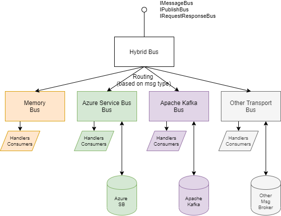
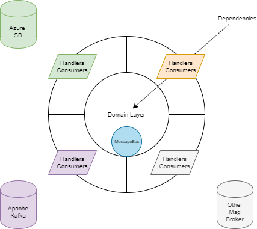

# Hybrid Provider for SlimMessageBus <!-- omit in toc -->

Please read the [Introduction](intro.md) before reading this provider documentation.

- [What is the Hybrid provider?](#what-is-the-hybrid-provider)
- [Use cases](#use-cases)
- [Configuration](#configuration)
  - [Shared configuration](#shared-configuration)
  - [Configuration modularization](#configuration-modularization)

## What is the Hybrid provider?

The Hybrid bus enables a composition of other available transport providers into one bus that your entire application / service uses.
This allows different layers of your service to work with just one `IMessageBus` interface, and relaying on the Hybrid bus to route your message to the respective transport provider based on configuration.

Package: [SlimMessageBus.Host.Hybrid](https://www.nuget.org/packages/SlimMessageBus.Host.Hybrid/)



## Use cases

A typical example would be when your service has a domain layer which uses domain events passed in memory (SlimMessageBus.Host.Memory transport), but any other layer (application or adapter) need to communicate with the outside world using something like Azure Service Bus or Apache Kafka transports.



## Configuration

Here is an example configuration taken from [Sample.Hybrid.ConsoleApp](../src/Samples/Sample.Hybrid.ConsoleApp) sample:

```cs
services.AddSlimMessageBus((mbb, svp) =>
{
    // In summary:
    // - The CustomerChangedEvent messages will be going through the SMB Memory provider.
    // - The SendEmailCommand messages will be going through the SMB Azure Service Bus provider.
    // - Each of the bus providers will serialize messages using JSON and use the same DI to resolve consumers/handlers.
    mbb
        // Bus 1
        .AddChildBus("Memory", (mbbChild) =>
        {
            mbbChild
                .Produce<CustomerEmailChangedEvent>(x => x.DefaultTopic(x.MessageType.Name))
                .Consume<CustomerEmailChangedEvent>(x => x.Topic(x.MessageType.Name).WithConsumer<CustomerChangedEventHandler>())
                .WithProviderMemory(new MemoryMessageBusSettings { EnableMessageSerialization = false });
        })
        // Bus 2
        .AddChildBus("AzureSB", (mbbChild) =>
        {
            var serviceBusConnectionString = Secrets.Service.PopulateSecrets(Configuration["Azure:ServiceBus"]);
            mbbChild
                .Produce<SendEmailCommand>(x => x.DefaultQueue("test-ping-queue"))
                .Consume<SendEmailCommand>(x => x.Queue("test-ping-queue").WithConsumer<SmtpEmailService>())
                .WithProviderServiceBus(new ServiceBusMessageBusSettings(serviceBusConnectionString));
        })
        .WithSerializer(new JsonMessageSerializer()) // serialization setup will be shared between bus 1 and 2
        .WithProviderHybrid();
},
addConsumersFromAssembly: new[] { typeof(CustomerChangedEventHandler).Assembly });
```

In the example above, we define the hybrid bus to create two kinds of transports - Memory and Azure Service Bus:

- The message type `CustomerEmailChangedEvent` published will be routed to the memory bus for delivery.
- Conversely, the `SendEmailCommand` will be routed to the Azure Service Bus transport.

> Currently, routing is determined based on the message type. Because of that, you cannot have the same message type handled by different bus transports.

The `IMessageBus` injected into any layer of your application will be the hybrid bus, therefore production of a message will be routed to the respective bus implementation (memory or Azure SB in our example).

It is important to understand, that handlers (`IHandler<>`) or consumers (`IConsumer<>`) registered will be managed by the respective child bus that they are configured on.

### Shared configuration

Any setting applied at the hybrid bus builder level will be inherited by ech child transport bus. In the example mentioned, the memory and Azure SB busses will inherit the serializer and dependency resolver.

Individual child busses can provide their own serialization (or any other setting) and effectively override the serialization (or any other setting).

> The Hybrid bus builder configurations of the producer (`Produce()`) and consumer (`Consume()`) will be added into every child bus producer/consumer registration list.

### Configuration modularization

The [Modularization of configuration](intro.md#modularization-of-configuration) section mentions the usage of `IMessageBusConfigurator` interface.
The `busName` param corresponds to the child bus name that was added as part of the hybrid bus setup. During bus creation the DI will be asked to resolve all implementations of `IMessageBusConfigurator` and SMB will execute the interface method against the root bus as well as every child bus.

> The root bus (hybrid transport) will have `busName` set to `null`.

Note that it is also possible to add a child bus from the `IMessageBusConfigurator` like in this case:

```cs
public class AzureServiceBusConfigurator : IMessageBusConfigurator
{
    private readonly IConfiguration _configuration;

    public AzureServiceBusConfigurator(IConfiguration configuration) => _configuration = configuration;

    public void Configure(MessageBusBuilder builder, string busName)
    {
        if (busName != null) return; // ensure it only runs for the root (hybrid) bus

        // add Azure Service Bus as child bus
        builder.AddChildBus("AzureSB", (mbb) =>
        {
            var topic = "integration-external-message";
            mbb.Produce<ExternalMessage>(x => x.DefaultTopic(topic));
            mbb.Consume<ExternalMessage>(x => x.Topic(topic).SubscriptionName("test").WithConsumer<ExternalMessageConsumer>());
            var connectionString = Secrets.Service.PopulateSecrets(_configuration["Azure:ServiceBus"]);
            mbb.WithProviderServiceBus(new ServiceBusMessageBusSettings(connectionString));
        });
    }
}
```

That allows for modularization of transports that are being introduced by each of your application layers.
